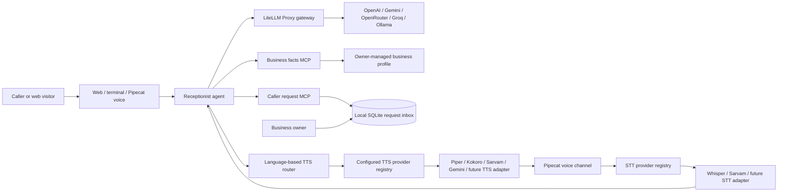

# Common AI Receptionist

A configurable receptionist starter for small businesses. It answers basic questions from owner-provided facts, collects callback or appointment requests, and leaves those requests for staff to review. The same business profile and MCP tools can be used by the web demo, terminal chat, or a live voice channel.

The starter is intentionally business-neutral: a clinic, repair shop, salon, tutor, or local service business can change its profile and connect its own scheduling or CRM tools without retraining the language model.

## What works today

- Profile-driven business name, greeting, hours, service area, languages, services, FAQs, and policies.
- A web chat with optional browser speech recognition.
- A terminal chat for trying the receptionist.
- Two MCP servers: verified business information and a caller-request inbox.
- An optional LiteLLM Proxy gateway with configurable routes for OpenAI, Gemini, OpenRouter, Groq, and local Ollama.
- Callback and appointment requests are saved as `needs_review`; the agent must read details back and get the caller's explicit yes before creating one.
- The caller-facing agent cannot read other callers' open requests. Staff can review the inbox from the local terminal agent.
- An optional Pipecat live audio runner with Exotel transport, local Whisper speech-to-text, Hindi Piper output, English Kokoro output, the selected LiteLLM-routed language model, and the same MCP tools.

The web and terminal paths are prototypes. The Pipecat runner is a starter integration, not a production phone service: an Exotel account, webhook/WebSocket setup, network deployment, monitoring, and field testing are still needed. With the local defaults, speech recognition uses Whisper `base` on CPU, English speech uses Kokoro, and Hindi or Devanagari Hindi-English uses Piper. These smaller local models trade some recognition accuracy and voice naturalness for offline use and low hardware requirements; benchmark them with real callers before relying on them. A saved request is never a confirmed booking. There is no calendar integration, automatic human transfer, WhatsApp connection, authentication, tenant isolation, or production data-retention policy yet.

## Set up the business profile

Copy `src/margin_guard/config/business_profile.example.json` to `business-profile.json` and fill it with facts approved by the business owner. The example path is already set in `.env.example`. Keep customer data and secrets out of the profile and Git.

The profile is the business adaptation layer. Add or change `services`, `faqs`, `hours`, `service_area`, and `policies`; do not fine-tune a model for each shop at this stage. Fine-tuning can be considered later only if measured call transcripts show a repeatable language or behavior gap that configuration and prompt changes cannot fix.

## Run the web or terminal prototype

Requires Python 3.11+, a provider account/key (or local Ollama), and the LiteLLM Proxy gateway.

```bash
python -m venv .venv
source .venv/bin/activate
pip install -e '.[gateway]'
cp .env.example .env
cp gateway.env.example gateway.env
cp src/margin_guard/config/business_profile.example.json business-profile.json
# Set LLM_API_KEY and LITELLM_MASTER_KEY to the same local-only value.
# Put the selected provider key in gateway.env.
python scripts/run_gateway.py
```

In a second terminal, activate the same virtual environment and run:

```bash
ai-receptionist-web
```

Open `http://127.0.0.1:8000`. The server binds to localhost. Set `RECEPTIONIST_DB` to choose a local SQLite file. To use the terminal version, run `ai-receptionist`.

### Choose a language model route

LiteLLM Proxy is the model gateway. The receptionist app reads only its gateway URL, model alias, and gateway key from `.env`. The gateway runner separately loads `gateway.env`, so provider keys stay out of the app process and MCP tool subprocesses. Select one alias in `.env`, set that provider's key in `gateway.env`, and restart the gateway:

| `LLM_MODEL` | Provider key | Model configured in `litellm_config.yaml` |
| --- | --- | --- |
| `receptionist-openai` | `OPENAI_API_KEY` | `gpt-4.1-mini` |
| `receptionist-gemini` | `GEMINI_API_KEY` | `gemini-3.8-flash` |
| `receptionist-openrouter` | `OPENROUTER_API_KEY` | `google/gemini-3.8-flash` |
| `receptionist-groq` | `GROQ_API_KEY` | `llama-3.3-70b-versatile` |
| `receptionist-ollama` | No provider key | `qwen2.5:7b` |

For Ollama, install and start Ollama, then download the configured model (for example, `ollama pull qwen2.5:7b`). The default server address is `http://localhost:11434`; change `OLLAMA_BASE_URL` in `gateway.env` if yours differs. You can edit the alias and provider model in `litellm_config.yaml` to add or replace routes. Keep keys in `.env` and `gateway.env`, which are excluded from Git. The sample gateway key is for local development; keep both services bound to localhost and use a separately scoped key with a protected deployment before making the gateway reachable outside your computer.

The Gemini and OpenRouter Gemini routes set low reasoning effort for faster receptionist replies; complex tasks may benefit less from that setting.

The gateway uses model aliases and environment-backed secrets, with one retry, a request timeout, and a cooldown after repeated failures. Routing is explicit: switching aliases does not silently switch providers or add cost. LiteLLM recommends simple-shuffle routing for multiple deployments under one alias; use that if you later add equivalent backups. Tool calling still depends on provider/model compatibility. See LiteLLM's [routing documentation](https://docs.litellm.ai/docs/routing) and [provider list](https://docs.litellm.ai/docs/providers).

Browser speech recognition depends on the browser and may send audio to its speech service. Chat messages are sent to the configured model provider. Use invented data until privacy, retention, security, and deletion requirements are addressed.

## Optional live voice runner

The live audio path uses [Pipecat](https://github.com/pipecat-ai/pipecat), following the project’s [Exotel inbound example](https://github.com/pipecat-ai/pipecat-examples/tree/main/exotel-chatbot/inbound) and [MCP client integration](https://docs.pipecat.ai/api-reference/server/utilities/mcp/mcp). On an 8 GB CPU-only laptop, start with the local Whisper `base` model, Piper Hindi voice, and Kokoro English voice:

```bash
python3.13 -m venv .venv-voice
source .venv-voice/bin/activate
pip install -e '.[gateway,voice-local]'
```

Use Python 3.13 for this optional voice environment; the currently published Kokoro runtime does not support Python 3.14. `VOICE_STT_PROVIDER=whisper` downloads the multilingual Faster Whisper `base` model on first launch and runs it on CPU with int8. Change `WHISPER_MODEL` to `tiny` for lower memory and faster responses, or `small` for a quality comparison if your machine has enough free memory. Whisper processes each completed speech segment, so it may wait for the caller to finish before the transcript is ready.

`VOICE_TTS_PROVIDER=auto` selects services from `VOICE_TTS_ROUTES`. The default, `hi=piper,en=kokoro`, sends Hindi and Devanagari Hindi-English to Piper and English to Kokoro (`af_heart`). Add a route such as `ta=some-provider` to configure another language after registering an adapter that supports it. `VOICE_TTS_LATIN_LANGUAGE` chooses the route for Latin-script replies (English by default); set it to `es` for a Spanish-first business and add a matching `es=provider` route. `VOICE_TTS_FALLBACK_LANGUAGE` chooses the route for text whose script cannot be identified. Model and voice settings stay with their adapter, such as `PIPER_HI_VOICE` and `KOKORO_VOICE`. First use downloads model files into the local cache. When selecting a single TTS provider, set `VOICE_TTS_LANGUAGE` if it should speak a language other than its default.

Speech services use a small registry in `src/margin_guard/speech/providers.py`. To add a model, write a factory that returns a Pipecat STT or TTS service and register it with `SPEECH_PROVIDERS.register_stt(...)` or `SPEECH_PROVIDERS.register_tts(...)`. A separately installed adapter package can register itself on import; set `SPEECH_PROVIDER_MODULES=your_package.speech_adapter` to load it. For example, an adapter can register `SPEECH_PROVIDERS.register_tts("indic_mio", build_tts)` where `build_tts(language)` creates that provider's Pipecat service. Then select it through `VOICE_STT_PROVIDER` or `VOICE_TTS_ROUTES`, for example `hi=indic_mio,en=kokoro`. The call pipeline and language router stay unchanged when a provider is replaced. Use `VOICE_TTS_PROVIDER=<name>` to use one provider for every response.

The in-process Piper package is GPL-3.0 licensed, and each downloaded voice has its own terms. Review those licenses before redistributing a packaged application. For comparison, set `VOICE_STT_PROVIDER=sarvam` and/or route a language to `sarvam`; these choices require `SARVAM_API_KEY` and may incur provider charges. The voice runner sends language-model requests through LiteLLM as before. See Pipecat's [Whisper](https://docs.pipecat.ai/api-reference/server/services/stt/whisper), [Piper](https://docs.pipecat.ai/api-reference/server/services/tts/piper), and [Kokoro](https://docs.pipecat.ai/api-reference/server/services/tts/kokoro) service docs.

Start the Pipecat runner with:

```bash
python -m margin_guard.voice_agent -t exotel
```

Connect the Exotel call stream to the Pipecat server using [Exotel's AgentStream setup guide](https://developer.exotel.com/docs/agentstream/connect-voice-ai) and Pipecat's current instructions. Do not expose the development runner as a public service.

## Architecture



Pipecat is the real-time voice pipeline and transport layer; it is not the speech model. The STT and TTS registries translate stable provider names into Pipecat services, keeping model-specific settings inside their adapters. The language model handles conversation, and MCP exposes bounded business actions. The web and terminal prototypes currently use the OpenAI Agents SDK. They reuse the MCP servers rather than sharing a single agent runtime.

## Borrowed patterns and source projects

- [Pipecat](https://github.com/pipecat-ai/pipecat) and its [Exotel inbound example](https://github.com/pipecat-ai/pipecat-examples/tree/main/exotel-chatbot/inbound) for live audio pipelines and telephony transport.
- [Pipecat MCP client](https://docs.pipecat.ai/api-reference/server/utilities/mcp/mcp) and the [MCP Python SDK](https://github.com/modelcontextprotocol/python-sdk) for tool boundaries.
- [OpenAI Agents SDK](https://github.com/openai/openai-agents-python) for the text/terminal prototype and approval flow.
- [LiteLLM Proxy](https://github.com/BerriAI/litellm) model aliases, env-backed provider credentials, and routing configuration for one OpenAI-compatible gateway endpoint.

These projects inform the design; this repository does not copy their source. Keep tools narrow: business facts are read-only, while the only write in the current receptionist is a request for human review.

## Useful next steps

1. Test Hindi and Hinglish understanding and voice pronunciation with consenting local business owners; compare local and hosted STT/TTS adapters on the same short call scripts.
2. Add explicit human handoff and a real scheduling integration, keeping appointment requests distinct from confirmed bookings.
3. Add authentication, business-level data separation, encryption, retention/deletion controls, and call-consent handling before any real customer data.
4. Measure missed-call recovery, request accuracy, latency, owner corrections, and cost per completed conversation before choosing a narrow vertical or adding training.

## Licenses

This starter is MIT licensed. Check the terms for each model, voice, service, and telephony provider before deployment.
