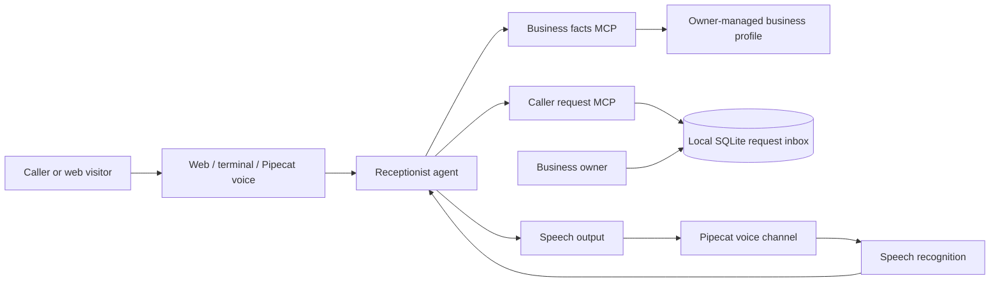

# Common AI Receptionist

A configurable receptionist starter for small businesses. It answers basic questions from owner-provided facts, collects callback or appointment requests, and leaves those requests for staff to review. The same business profile and MCP tools can be used by the web demo, terminal chat, or a live voice channel.

The starter is intentionally business-neutral: a clinic, repair shop, salon, tutor, or local service business can change its profile and connect its own scheduling or CRM tools without retraining the language model.

## What works today

- Profile-driven business name, greeting, hours, service area, languages, services, FAQs, and policies.
- A web chat with optional browser speech recognition.
- A terminal chat for trying the receptionist.
- Two MCP servers: verified business information and a caller-request inbox.
- Callback and appointment requests are saved as `needs_review`; the agent must read details back and get the caller's explicit yes before creating one.
- The caller-facing agent cannot read other callers' open requests. Staff can review the inbox from the local terminal agent.
- An optional Pipecat live audio runner with Exotel transport, Sarvam speech-to-text, configurable Sarvam or Kokoro speech output, OpenAI language model, and the same MCP tools.

The web and terminal paths are prototypes. The Pipecat runner is a starter integration, not a production phone service: an Exotel account, webhook/WebSocket setup, provider keys, network deployment, monitoring, and field testing are still needed. Live-call speech output uses one configured language per worker; it does not switch voices for each caller yet. A saved request is never a confirmed booking. There is no calendar integration, automatic human transfer, WhatsApp connection, authentication, tenant isolation, or production data-retention policy yet.

## Set up the business profile

Copy `src/margin_guard/config/business_profile.example.json` to `business-profile.json` and fill it with facts approved by the business owner. The example path is already set in `.env.example`. Keep customer data and secrets out of the profile and Git.

The profile is the business adaptation layer. Add or change `services`, `faqs`, `hours`, `service_area`, and `policies`; do not fine-tune a model for each shop at this stage. Fine-tuning can be considered later only if measured call transcripts show a repeatable language or behavior gap that configuration and prompt changes cannot fix.

## Run the web or terminal prototype

Requires Python 3.11+ and an OpenAI API key.

```bash
python -m venv .venv
source .venv/bin/activate
pip install -e .
cp .env.example .env
cp src/margin_guard/config/business_profile.example.json business-profile.json
# Set OPENAI_API_KEY and BUSINESS_PROFILE in .env
ai-receptionist-web
```

Open `http://127.0.0.1:8000`. The server binds to localhost. Set `RECEPTIONIST_DB` to choose a local SQLite file. To use the terminal version, run `ai-receptionist`.

Browser speech recognition depends on the browser and may send audio to its speech service. Chat messages are sent to the configured model provider. Use invented data until privacy, retention, security, and deletion requirements are addressed.

## Optional live voice runner

The live audio path uses [Pipecat](https://github.com/pipecat-ai/pipecat), following the project’s [Exotel inbound example](https://github.com/pipecat-ai/pipecat-examples/tree/main/exotel-chatbot/inbound), [Sarvam voice example](https://github.com/pipecat-ai/pipecat/blob/main/examples/voice/voice-sarvam.py), and [MCP client integration](https://docs.pipecat.ai/api-reference/server/utilities/mcp/mcp). Install the optional voice dependencies:

```bash
pip install -e '.[voice]'
```

Configure `OPENAI_API_KEY` and `SARVAM_API_KEY`. Sarvam is the India-first default for speech input and output. Change `SARVAM_TTS_LANGUAGE` for the deployment's main spoken language. [Kokoro 82M](https://github.com/hexgrad/kokoro) is a local Hindi-capable TTS alternative; Pipecat's [Kokoro adapter](https://docs.pipecat.ai/api-reference/server/services/tts/kokoro) runs it locally, but Kokoro only speaks and still needs a separate speech recognizer. To add it, install `pip install -e '.[voice,voice-kokoro]'` using Python 3.11–3.13, then set `VOICE_TTS_PROVIDER=kokoro`. This environment uses Python 3.14, which cannot currently resolve Kokoro's optional package. [Qwen3-TTS](https://github.com/QwenLM/Qwen3-TTS) can be evaluated later behind the TTS boundary, but its official release currently lists ten languages without Hindi.

Start the Pipecat runner with:

```bash
python -m margin_guard.voice_agent -t exotel
```

Connect the Exotel call stream to the Pipecat server using [Exotel's AgentStream setup guide](https://developer.exotel.com/docs/agentstream/connect-voice-ai) and Pipecat's current instructions. Do not expose the development runner as a public service.

## Architecture



Pipecat is the real-time voice pipeline and transport layer; it is not the speech model. Sarvam or Kokoro provides voice services, the language model handles conversation, and MCP exposes bounded business actions. The web and terminal prototypes currently use the OpenAI Agents SDK. They reuse the MCP servers rather than sharing a single agent runtime.

## Borrowed patterns and source projects

- [Pipecat](https://github.com/pipecat-ai/pipecat) and its [Exotel inbound example](https://github.com/pipecat-ai/pipecat-examples/tree/main/exotel-chatbot/inbound) for live audio pipelines and telephony transport.
- [Pipecat MCP client](https://docs.pipecat.ai/api-reference/server/utilities/mcp/mcp) and the [MCP Python SDK](https://github.com/modelcontextprotocol/python-sdk) for tool boundaries.
- [OpenAI Agents SDK](https://github.com/openai/openai-agents-python) for the text/terminal prototype and approval flow.

These projects inform the design; this repository does not copy their source. Keep tools narrow: business facts are read-only, while the only write in the current receptionist is a request for human review.

## Useful next steps

1. Test Hindi and Hinglish understanding and voice pronunciation with consenting local business owners; compare Sarvam and Kokoro on the same short call scripts, including the fixed-language output limitation.
2. Add explicit human handoff and a real scheduling integration, keeping appointment requests distinct from confirmed bookings.
3. Add authentication, business-level data separation, encryption, retention/deletion controls, and call-consent handling before any real customer data.
4. Measure missed-call recovery, request accuracy, latency, owner corrections, and cost per completed conversation before choosing a narrow vertical or adding training.

## Licenses

This starter is MIT licensed. Check the terms for each model, voice, service, and telephony provider before deployment.
